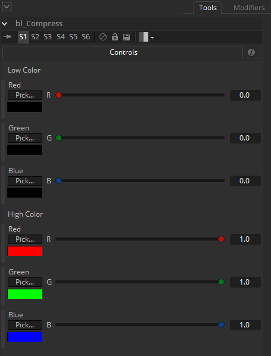

## bl_Compress

This is a common color correction function that push the low color to a value and the high color to another. While tempting to make a color matching between 2 picture this Macro might be really usefull.

## Input:

Img : RGBA

## Controls:

Red Low : Red low value.

Green Low : Green low value.

Blue Low : Blue low value.

Red High : Red high value.

Green High : Green high value.

Blue High : Blue high value.

## Result:

