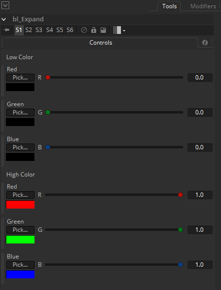

## bl_Expand

Does the exact reverse of the Compress node. It stretches the color between to low and high color values.

## Input:

Img : RGBA

## Controls:

Red Low : Red low value.

Green Low : Green low value.

Blue Low : Blue low value.

Red High : Red high value.

Green High : Green high value.

Blue High : Blue high value.

## Result:

