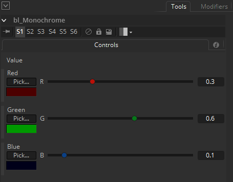

## bl_Monochrome

Same as the Shake's Monochrome node. You can play independently with the 3 color component.

## Input:

Img : RGBA

## Controls:

Red : Red amount.

Green : Green amount.

Blue : Blue amount.

## Result:

