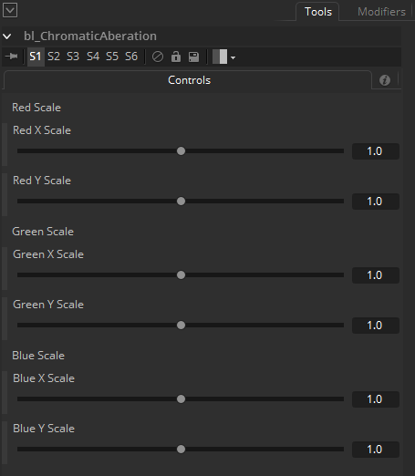

## bl_ChromaticAberation

A simple chromatic aberation tool.

## Input:

Img : RGBA

## Controls:

Red X Scale : Red channel X Scale

Red Y Scale : Red channel Y Scale

Green X Scale : Green channel X Scale

Green Y Scale : Green channel Y Scale

Blue X Scale : Blue channel X Scale

Blue Y Scale : Blue channel Y Scale

## Result:

